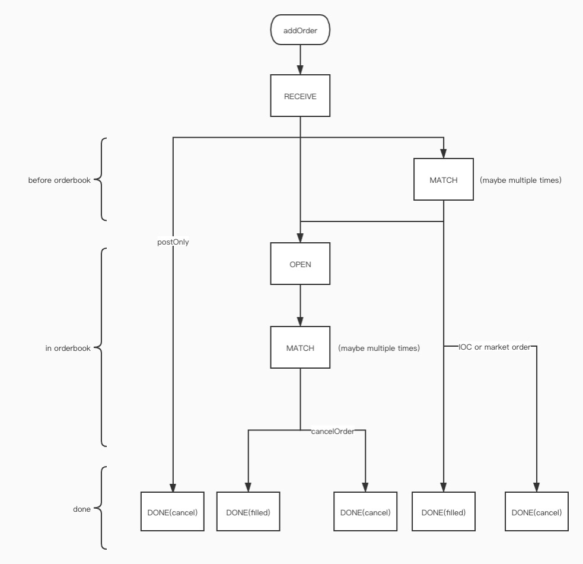

[](https://github.com/Kucoin-academy/Guide)
[](https://github.com/Kucoin-academy/best-practice)
[](https://github.com/Kucoin-academy/best-practice)
[](https://github.com/Kucoin-academy/best-practice/issues)

[](README_EN.md)
[](README_CN.md)

# KuCoin API Best Practice

## Forward

It is import for quant traders to know how to access the exchange APIs in a scientific and efficient way, and handle the exceptions gracefully. This article will provide the best practice for accessing KuCoin exchange. You can customize your own code based on this best practice. If you have any question or find any problem about the content below, you are welcome to raise an ISSUE to feedback.

## Body

There are two issues to highlight for the HFT traders (who tend to submit more than 10 orders per second or require a low-latency trading system).

1. How to get the exchange market data quickly and accurately
2. How to maintain your order status quickly and accurately

The KuCoin server is set up in **AWS Tokyo, Japan** We also provide private_link method to allow connecting to KuCoin in a faster and more stable way. If you need private_link, please send an email to **newapi@kucoin.plus** or contact us through Telegram: **@KuCoin_API_Team.**

**Notice: KuCoin's official API Telegram only provides technical support. It will not ask users for any personal or account information, and will not require users to pay any fees.**

### How to get the exchange market data quickly and accurately

1. [**REST request method (not recommended)**](https://docs.kucoin.com/#get-ticker)

   Directly call the rest endpoint, How to use: Take KuCoin as an example https://docs.kucoin.com/#get-ticker

   **Advantages**: 

   * The call is simple to use 

   * Suitable for low-frequency strategies which are not reliable on fast market data feed

   **Disadvantages**: 

   * High latency

   * Endpoint frequency limitation

   **When to use**:

   * Low-frequency strategies
   * When other protocols encounters problems such as WebSocket failure, your risk control system can use this method to obtain market data for further operations.

2. [**WebSocket Level-2 Market Data Feed Full-Data(recommended)**](https://docs.kucoin.com/#level2-5-best-ask-bid-orders)

   KuCoin provides the Level-2 WebSocket market data feed with 5 levels and 50 levels (consolidated order size for each price level), and the feed time interval is around 100ms. 

3. [**WebSocket Level-2 Market Data Feed Increment-Data(recommended)**](https://docs.kucoin.com/#level-2-market-data)

   KuCoin provides the Level-2 WebSocket market data feed to create increment order book.

4. [**WebSocket Level-3 Market Data Feed(recommended)**](https://docs.kucoin.com/#full-matchengine-data-revision-level-nbsp-3)

   Build the whole exchange order-book locally and directly read the data from the local memory by subscribing the Level-3 incremental market data feed.

### How to maintain your order status quickly and accurately

1. [**REST request method (not recommended)**](https://docs.kucoin.com/#get-an-order)
   
   * Directly call the rest endpoint, How to use: Take KuCoin as an example https://docs.kucoin.com/api/v1/orders/{order-id}
* Because the REST request is lagging, the order may be filled right after you query the order information. So if you are a high-frequency trader, it is only recommended that you use rest requests in compensation logic and risk control logic.
   
2. [**Websockt Private channels (recommended)**](https://docs.kucoin.com/#private-channels)

   Obtain your own order information by subscribing to the private channel. The private channel will push the data of your own orders in real time. Instead of frequently querying your own orders status via REST requests, you can save your frequency-limit and get order status faster.

3. [**Websocket Level-3 Feed (recommended)**](https://docs.kucoin.com/#full-matchengine-data-revision-level-nbsp-3)
   
   * If you are a HFT trader, it is strongly recommended that you use public Level-3 market data feed to maintain your own orders. Level-3 feed comes directly from the matching engine, and is the fastest way to maintain your order status. Besides, the Level-3 incremental feed can guarantee a complete accuracy.
   * Level-3 data feed is streamlined and incremental. Each message has a sequence number, so you can check whether you have received every message out there.

### Let's start with a simple RECEIVE message as an example

```
 {
   "topic": "/spotMarket/level3v2:BTC-USDT",
   "subject": "received",
   "data": {
       "symbol": "BTC-USDT",                        // symbol
       "sequence": 3262786900,                 // sequence
       "orderId": "5f0186a2d765040006f0b1fa",  // order ID
       "clientOid": "a4ba662f77180b69f186aa578aa52cb6", // optional, for you to identify your order
       "ts": 1545914149935808589
    }
 }
```

Generally, Level-3 feed has three fields: topic, subject and data. There are topics for channels, subject for message types, and data for specific message content. 

Let’s look at a flow chart firstly,



This flowchart clearly describes the Level-3 message and various situations that may be received after an order is placed.

After you place an order, **you will usually receive a RECEIVE message**. Within the KuCoin trading system, the latency between receiving an order entry request and sending out a RECEIVE message will **not be greater than 10ms**. 

**Assuming that your network latency to KuCoin is 20ms, in theory, you will receive a RECEIVE message 30ms after you submit the order. The return of RECEIVE messages is usually faster than the return of the order request itself, so you need to attach clientOid when placing order, and maintain two key-value data structures locally. One is clientOid being as the key, and the order object being as the value, which is used to maintain order status locally. Various languages ​​provide such data structures. Cache systems such as redis and memcache also provide key-value structures**.

Let’s say you placed an order with clientOid of *a4ba662f77180b69f186aa578aa52cb6* in the BTC-USDT trading pair, the quantity is 1, and the buy price is $9000. Before placing the order, you should have such a data structure locally.

``` 
{
"a4ba662f77180b69f186aa578aa52cb6": {
    "orderId": "",
    "size": "1",
    "status": "",
    "price": "9000",
    "side": "buy",
    "symbol": "BTC-USDT",
    "dealSize": "0"
    }
}
```
After you receive the RECEIVE message: 

```
 {
   "topic": "/spottMarket/level3v2:BTC-USDT",
   "subject": "received",
   "data": {
       "symbol": "BTC-USDT",                        // symbol
       "sequence": 3262786900,                 // sequence
       "orderId": "5f0186a2d765040006f0b1fa",  // order ID
       "clientOid": "a4ba662f77180b69f186aa578aa52cb6", // optional, for you to identify your order
       "ts": 1545914149935808589
    }
 }
```

So you judge by clientOid that this RECEIVE message belongs to your own order. At this time, you can update your local data structure. If you are using a key-value structure, the time complexity should be O(1). **If you did not receive the RECEIVE message after a certain time (up to 1s) after placing an order, and the sequence you received keeps strictly incremental (meaning no message is lost), then your order must have failed to be placed**, and you should know you need to do something about it. (**Alternatively, if you are using the private channel and haven’t received a feed after placing an order, it may not necessarily be an order failure, and there could be a missing message. The message sequence in the public channel, however, must be strictly incremental. So in the case of continuous sequence, if you have not received an order feed within a certain period of time, you can be sure that the order placement has failed. There is no need to use REST to query your order status**.)

```
{
"a4ba662f77180b69f186aa578aa52cb6": {
    "orderId": "5f0186a2d765040006f0b1fa",
    "size": "1",
    "status": "RECEIVE",
    "price": "9000",
    "side": "buy
    "symbol": "BTC-USDT",
    "dealSize": "0"
    }
}
```

Since the related order messages will be associated with orderId later, it is recommended that you maintain a local orderId key structure like this:

```
{
"5f0186a2d765040006f0b1fa":
    {
    "orderId": "5f0186a2d765040006f0b1fa",
    "size": "1",
    "status": "RECEIVE",
    "price": "9000",
    "side": "buy
    "symbol": "BTC-USDT",
    "dealSize": "0",
    "clientOid":"a4ba662f77180b69f186aa578aa52cb6"
    }
}
```

After that, you only need to update this structure.

After receiving the RECEIVE message, you will also receive various types of messages according to the situation of your order, including OPEN, MATCH, UPDATE, DONE.

* OPEN indicates that the order has been placed in the orderbook
* MATCH stands for order matching
* UPDATE represents order modification
* DONE represents the end of the order lifecycle.

You only need to update your local order-book information according to the message received. **You local order-book is a mirror image of the exchange order-book.**

Here are a few details to note:

1. MATCH contains taker orderId and maker orderId at the same time.
2. postOnly does not mean that you must be on the maker side but can only guarantee that you pay the maker fee (maker fee is normally cheaper than the taker fee). Assuming you place a postOnly bid at $9000, while there is a hidden offer at $9000, then your order will directly start getting filled. If your bid size is bigger than the offer size, the rest of your order will be directly into the order-book. In this MATCH event, your direction is **taker**, while a maker fee is charged.
3. After canceling the order, you will definitely receive the DONE message. DONE message represents the successful cancellation of the order. There is no need to check the order status using REST or repeat the cancellation of the order, because the Level-3 feed is much faster than the REST query.

### Others Tips

1. **How to deal with the change of the account balance in the spot market**

   You can subscribe to our balance feed. The feed contains tradeId, which can be associated with the matching event. You can know exactly when your account balance is updated after order cancellation or order filling. Generally, the account balance latency is around 50ms.

2. **How to handle the futures positions**

   You can handle futures positions by subscribing to our position feed.

3. **How to handle self-trade in spot**

   KuCoin supports self-trade protection parameters. You can avoid self-trade by passing in parameters. Do note that the parameters work only if they are in the order of the taker direction.

